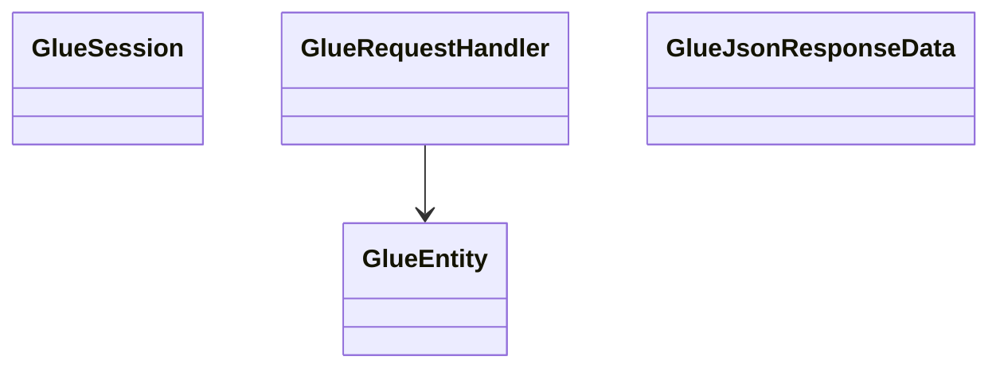
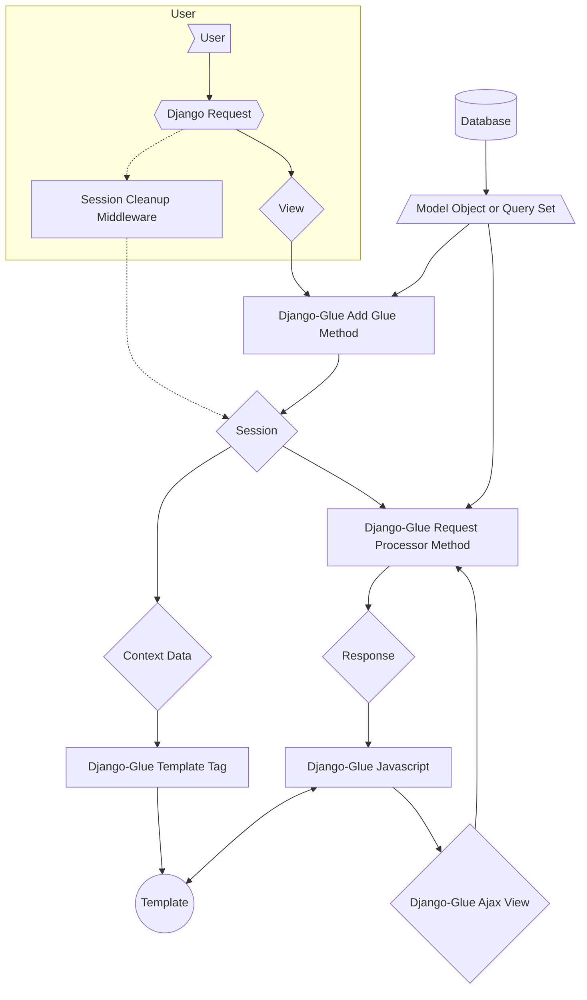

# Project Architecture 
Last Updated: Wesley Howery 2024-06-29

# Project Overview
### Purpose of Component 
- Showcase software architecture
- Communicate specific domain knowledge
- Understand deliverables and pain points. 

### Definitions, Acronyms and Abbreviations
Define any terminology or acronyms that are specific to the client's industry.
- Word - Description of the word for clarity. 
 
#
### Major Point Points
- Django has a proven backend structure for processing data and building web applications. To have reactivity in the front
end we either need to learn a new framework like react or write ajax functionality. This leads to many url endpoints and 
inconsistency with JS objects. Glue replicates the Django backend functionality of models in your front end.
- Django forms are great for validating and processing data, but lack the reactivity of modern web applications. Crispy forms 
is a great tool for rendering static forms. Complexity escalates quickly when users needs a more dynamic form system.  

### Major Deliverables 
- Access to backend structure and functionality in Glue Model Objects.
- Query abilities with Glue Query Sets. 
- Ajax shortcuts on all objects and Glue Views. 
- Dynamic form system with Glue Form Fields. 

# Project Structure 
## Accessing Glue Objects

An ERD diagram that illustrates our major entities and relationships. Each entity is either a database table or a class.
Our project architecture will reflect the terminology in the ERD.

### Short Description 
- Each component design document will cover details about the use case of the component and why it is structured this way.

#### Example
Companies are the highest level entity in our system and our architecture is structured to have a flexible permission structure.  

