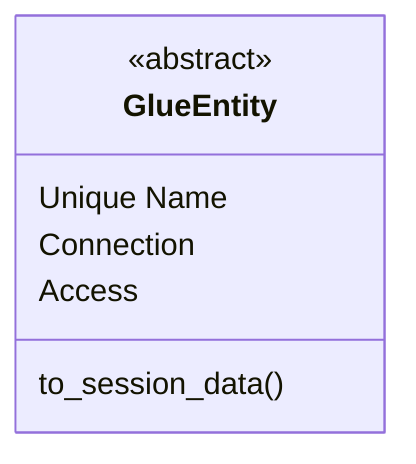

# Glue Entity Design Document 
Last Updated: Wesley Howery 2024-06-30

# Overview
### Purpose of Component 
Glue entities are the core of Django Glue. They represent python and django's core functionality and have the necessary
attributes to transfer that functionality into our JS front end.

### Definitions, Acronyms and Abbreviations
- Entity - A core object.     

### Reason To Change
When more information or functionality is needed across all glue entities. 

## Class Diagram
### Glue Entity
- Glue Entity contains the base information needed for each entity object to inherit. 
- Glue Entity's know how to store themselves as session data when they are glued.

