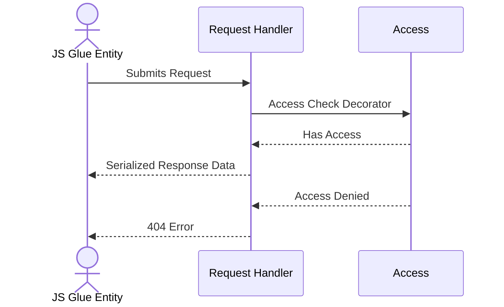
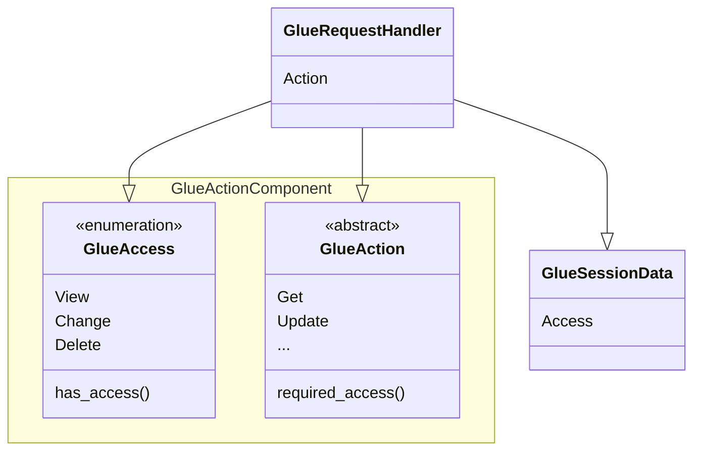

# Access Design Document 
Last Updated: Wesley Howery 2024-06-29

# Overview
### Purpose of Component 
Access provides controls to be able to regulate who has privileges to manipulate entities.  

### Definitions, Acronyms and Abbreviations
- View - Only can view the data. 
- Change - Ability to manipulate the data on the object and in the database.
- Delete - Can delete objects inside of the database.

### Reason To Change
If we need to provide more granular or special access to entities this component would have to change. 

## Actor Diagram
### Handler Checking Access


## Class Diagram
### Access
- The Glue Request Handler assembles the session data and check to see if the access provided in the session data matches
the access required on the action in the handler.
- Access is provided to the Glue JS Object through gluing in the view. This allows us to control the access level on the server side.  
```python
def task_form_view(request, pk):
    task = get_object_or_404(Task, pk=pk)
    glue_model(request, 'task', task, 'change') # Adds glue object to session data with access provided. 
```


### Check Access Decorator
Check access decorator lives on all handler process_response_data methods. It uses the action on the method to check if
the glue session data has the correct access level to perform the request. 
```python
class GetGlueModelObjectHandler(GlueRequestHandler):
    action = GlueModelObjectAction.GET
    _session_data_class = GlueModelObjectSessionData

    @check_access
    def process_response_data(self) -> GlueJsonResponseData:
        glue_model_object = glue_model_object_from_glue_session(self.session_data)
        return generate_json_200_response_data(
            message_title='Success',
            message_body='Successfully retrieved model object!',
            data=GlueModelObjectJsonData(glue_model_object.fields)
    )
```