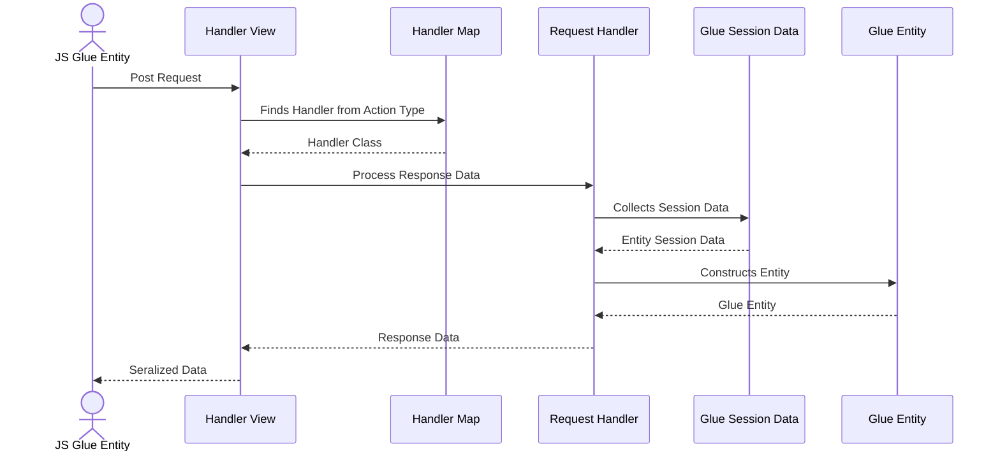
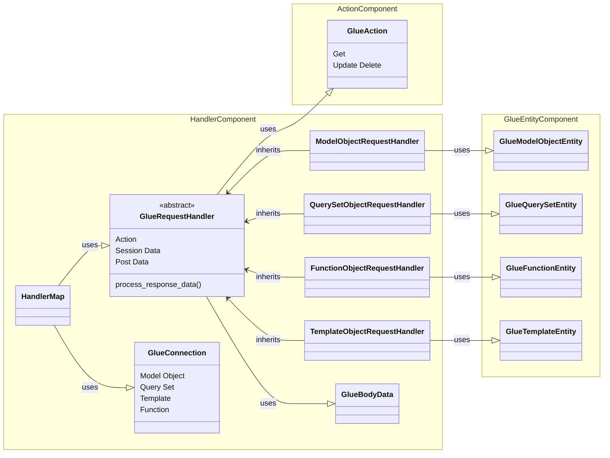

# Glue Model Object Design Document 
Last Updated: Wesley Howery 2024-06-29

# Overview
### Purpose of Component 
The Glue Request Handler is responsible for processing actions from Glue Entities. It provides a consistent and
extendable way to add and maintain processing glue entity requests from JS objects.

### Definitions, Acronyms and Abbreviations
- Handler - Handles the steps to receive, process and respond a Djagno Glue Request.    

### Reason To Change
The handler would change if we need to manipulate how we are processing data from the body or glue session.

## Actor Diagram
### Handler Processing  a Request

## Class Diagram
### Glue Request Handler
The Glue Request Handler is a stable abstract class that is inherited to provide action functionality on glue entities. 
- Inherit the Glue Request Handler to process new glue entities. 
- Add actions to inherited handlers to provide unique functionality. 
- **Handler Map** is responsible for returning the correct handler class based on connection and action. 
- Add connections and actions to maps that allows the glue to return the correct handler. 
- **Glue Body Data** defines what the handler expects from JS Objects to be able to correctly process the request. 

