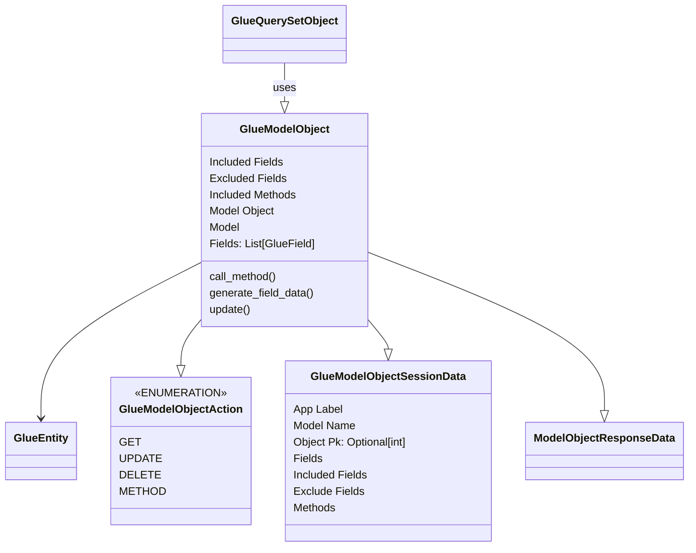

# Glue Model Object Design Document 
Last Updated: Wesley Howery 2024-06-29

# Overview
### Purpose of Component 
Glue Model Objects replicate the functionality of model objects in django. 

### Definitions, Acronyms and Abbreviations
- Handler - Handles the steps to receive, process and respond a Djagno Glue Request.    

### Reason To Change
The handler would change if we need to manipulate how we are processing data from the body or glue session.

### Dependencies
- Glue Query Set objects initialize glue model objects into a list. This means Glue Query Set's are heavily dependent on Glue Model Objects.
- Any changes to this component we need to consider the impact on Glue Query Set. 

## Class Diagram
### Glue Model Object 
- Included and excluded attributes are for controlling model permissions on our backend. We can decide what fields are exposed to the client. 
- Methods are added to Glue Model Object's to match functionality or handler actions.  

### Glue Model Object Action 
- **Get** fetches the model object from the database and loads the values into glue fields. 
- Field values are not stored in session data to preserve memory.
- **Update** looks at the fields included or excluded and updates the model object in the database accordingly.
- **Delete** removes the model object from the database. 
- **Method** calls a method on the model object. 

### Glue Model Object Session Data
- **App Label & Model Name** Are both needed to be able to load the model class. This allows us to query for the model object. 
- **Object Pk** Tells us the specific model object. If this is none it returns a null object with the default values and a pk of None.
- **Fields** Provides data on each field included on the model object. 
- **Include & Exclude Fields** Allows us to control access to object fields on the backend. 
- **Methods** Allows us to expose certain methods on the model object to call from our client. 

### Glue Model Object Response Data
Defines the structure of the repose data for each action.

## Improvements
- Glue Fields need to be improved. Move extra information into meta data.
- Response data needs to live in a clear spot? Currently it is in the base because it is shared by query set and model object.
  - I think this should just live in model object because Query set is dependent on model objects. 