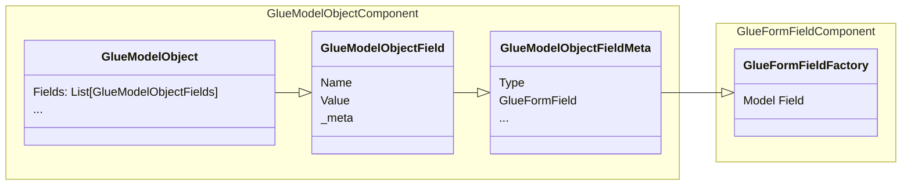

# Glue Form Field Design Document 
Last Updated: Wesley Howery 2024-07-01

# Overview
### Purpose of Component 
To aggregate data needed to be used across of django glue for form fields.

### Reason To Change
Adding extra functionality to model fields. 
- Added to field metadata. 

### Dependencies
- Glue Form Fields
- Glue Model Objects

## Class Diagram
### Glue Object Form Field
- Aggravate field that assembles the metadata needed for functionality across django glue.

## Improvements
- Move extra information to metadata.
- Need consistent way to serialize data. 