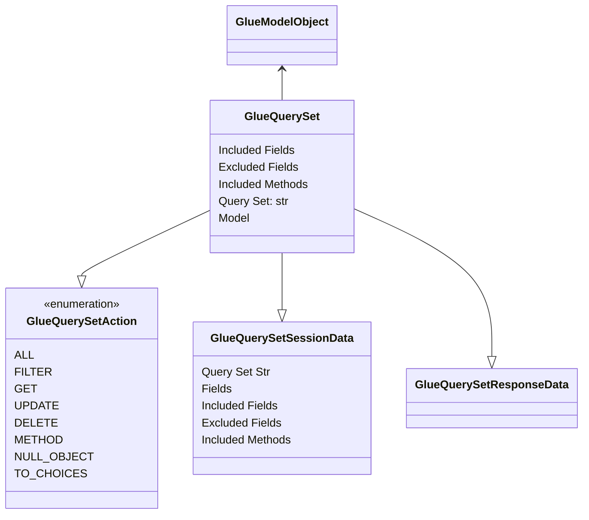

# Glue Query Set Design Document 
Last Updated: Wesley Howery 2024-06-30

# Overview
### Purpose of Component 
Glue Query Sets allow django glue to access the functionality of django query sets and exposes functionality to our client.

### Reason To Change
- When more actions are added to Glue Model Objects or onto Query Sets themselves.

### Dependencies
- Glue Query Sets return a list of Glue Model Objects.
- On the client side, glued query sets will have a connection type of query_set. 
  - Glue Model Objects will be created to for the client. 
  - Glue Model Objects created from a query set will use the query set handler. 
  - **This means all glue model object functionality needs to be accessible through the Query Set Handler.** 

## Class Diagram 
### Glue Query Set Actions 
- **All**: Returns all objects in the query set as glue model objects. 
- **Filter**: Returns filtered objects in the query set as glue model objects. Uses django's ORM filtering system.
- **Get**: Returns a specific glue model object. 
- **Update**: NOT IMPLEMENTED 
- **Delete**: Deletes all the model objects from the database. 
- **Method**: Calls a specific method on all the model objects in the query set.
- **Null Object**: Returns a null object with the default values of the model and a pk of None. 
- **To Choices**: Returns the query set as a list of lists that replicates how django choice fields define choices.   

### Glue Query Set Session Data 
- **Query Set Str**: A encoded pickled string of the SQL query. This can be loaded to re-create the Query Set Object. 
- **Fields**: The model object fields that the query set is linked to. 
  - This allows us to use Glue Form Fields with Glue Query Set Objects. 
- **Included / Excluded Fields & Methods** Control on server side on areas we want to expose to the client. 

