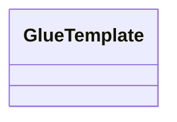

# Glue Template Design Document 
Last Updated: Wesley Howery 2024-06-30

# Overview
### Purpose of Component 
The Glue Request Handler is responsible for processing actions from Glue Entities. It provides a consistent and
extendable way to add and maintain processing glue entity requests from JS objects.

### Reason To Change
The handler would change if we need to manipulate how we are processing data from the body or glue session.

## Class Diagram

