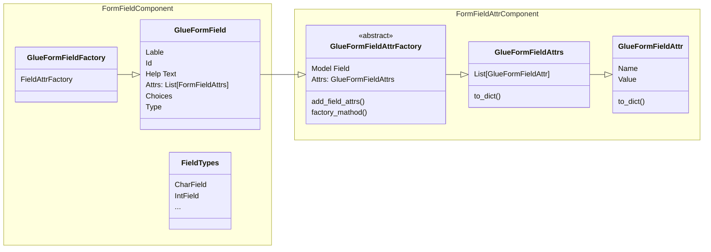

# Glue Form Field Design Document 
Last Updated: Wesley Howery 2024-07-01

# Overview
### Purpose of Component 
Utilizing django's model attributes, glue form fields construct field attributes and information needed to build form fields. 

### Reason To Change
Building more field fields or passing new attributes to our client.  

### Dependencies
- Glue model objects use django's form field attribute factory. 

## Class Diagram
### Glue Form Field
- Class that represents all attributes needed to initialize a JS glue form field. 
- Built to be extended.
- Model Fields are converted into these.
- What information is needed for each form field? Attrs are generated based on field type.  

### Field Types 
- Map of all django field types linked to a glue form field. 

### GlueFormFieldAtts
- A dict whose key is the name and value is a Glue Form Field Attr. 
- Factories are defined by django model fields. What attributes are set for specific fields that need to be translated to the client. 

### ModelFieldFactory 
- Used to convert model fields into glue form fields. 

## Improvements
- Remove Glue Attr Types. Glue fields will require the information needed.
- Do I need to create a glue form field for each field type or is the base information the same? 
  - Keep the map for attrs because they change for each. 
- Glue form fields should work independently of model fields. Factory used to convert.  