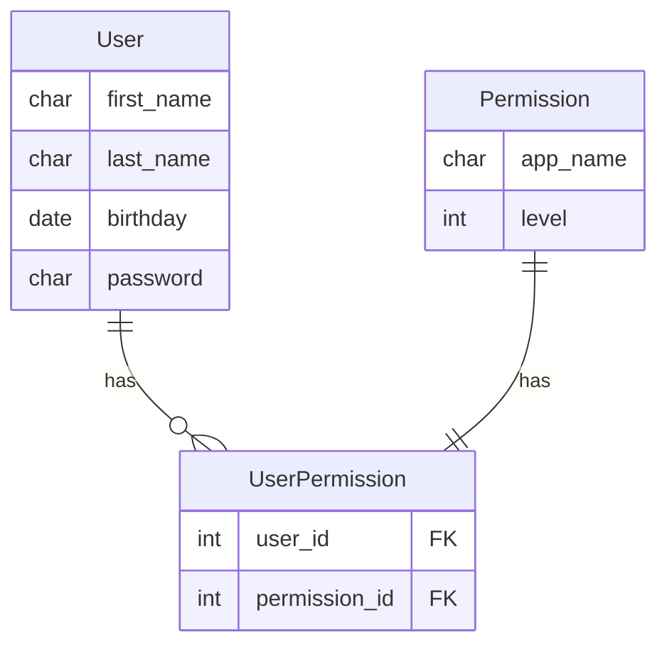
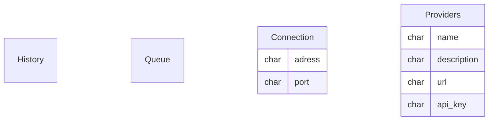

## Example

```mermaid
erDiagram
    User {
        char first_name
        char last_name
        date birthday
        char password
    }
    
    Permission {
        char app_name
        int level
    }
    
    UserPermission {
        int user_id FK
        int permission_id FK
    }
        
    
    
User ||--o{ UserPermission: has
Permission ||--|| UserPermission: has
``` 

# Watch Party

```mermaid
    erDiagram
        History {
            
        }
        Queue {
            
        }
        
        Connection {
            char adress
            char port
        }
        
        Providers {
            char name
            char description
            char url
            char api_key
        }
```