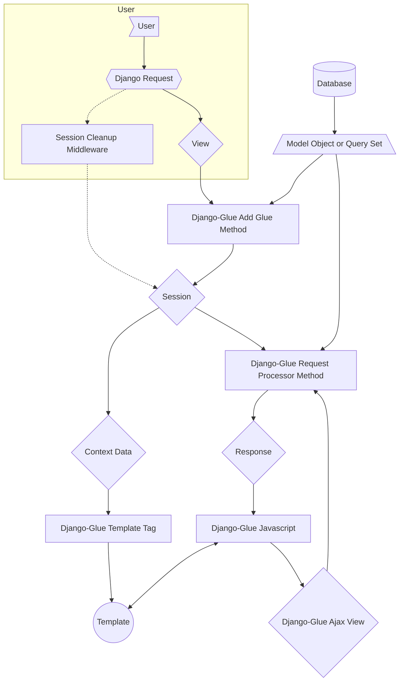

```mermaid
flowchart TD
    subgraph User
        user>User] --> django
        django{{Django Request}} -.-> middleware[Session Cleanup Middleware]
        django --> view
    end
    middleware -.-> session
    database[(Database)]
    database --> object
    object[/Model Object or Query Set\]
    view{View} --> add_glue[Django-Glue Add Glue Method]
    add_glue --> session{Session}
    object --> add_glue
    session --> context{Context Data}
    context --> template_tag[Django-Glue Template Tag]
    template_tag --> template((Template))
    javascript[Django-Glue Javascript] <--> template
    javascript --> ajax_view{Django-Glue Ajax View}
    ajax_view --> process_glue[Django-Glue Request Processor Method]
    session --> process_glue
    object --> process_glue
    process_glue --> response{Response}
    response --> javascript
```