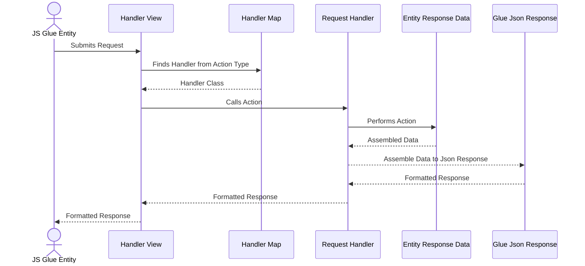
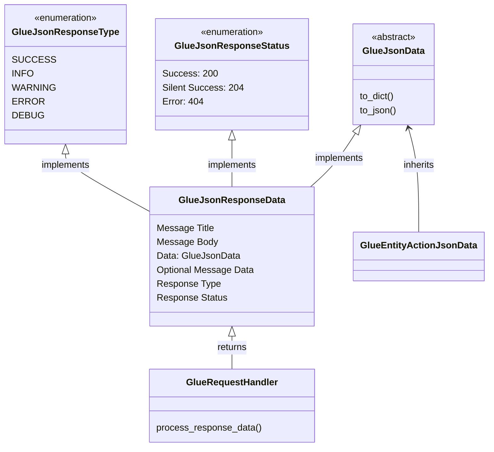

# Response Design Document 
Last Updated: Wesley Howery 2024-06-29

# Overview
### Purpose of Component 
Responses provide a consistent structure that returns data to the glue ajax call.  

### Definitions, Acronyms and Abbreviations
- Serialize - Processes python response data into JSON objects expected by our front end.     

### Reason To Change
To provide more response choices. 

## Actor Diagram
### Handler Returning a Response

## Class Diagram
### Responses 
- **Response Types** and **Statuses** provide consistent options for our front end to be able to process a response. 
- **Json Response Data** is a consistent structure to return response data and messages. Each request responds with the same format. 
- **Glue Json Data** is a stable class used for inheritance. It allows our entities to define how they will structure the 
response data from the action called. 
- Glue request handlers returns Json Response Data. Inside of that response, data is formatted according to the entity's Glue Json Data.

## Improvements
- Naming could be improved?
- Serialization needs to be more consistent.
  - Create serialization app. This interface should be used in one location. It is currently spread throughout the app.