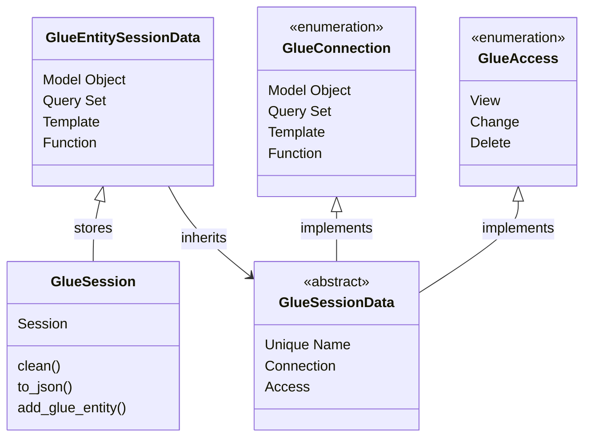

# Glue Session Data Design Document 
Last Updated: Wesley Howery 2024-06-29

# Overview
### Purpose of Component 
- Controls how glue accesses and stores data in django's session. 
- Defines data needed for glue to use session data.  

### Reason To Change
To add more structured data into the session.

## Glue Session Data
- **Glue Session** provides a unique key to store glue specific data in django's session. Here it can update and clean 
itself depending on the life span of the unique names.
- **Glue Session Data** is a stable abstract class that defines required attributes used for each glue entity. 
  - Unique name is a key that stores the related entity's data.
  - Connection tells the request handler what entity is available to construct.
  - Access provides a way to control the privileges from the sever side.
- **Glue Entity Session Data** are the inherited objects that add extra information required for the specific entity. 
  - For example, a Glue Model Object requires the app_label and model_name to be able to get the model object.  
```python
def task_form_view(request, pk):
    task = get_object_or_404(Task, pk=pk)
    glue_model(request, 'task', task)  # Constructs the entity, and turns it into data that is stored in the session.     
```



## Improvements
- Need to improve when / how we serialize the session data. 
