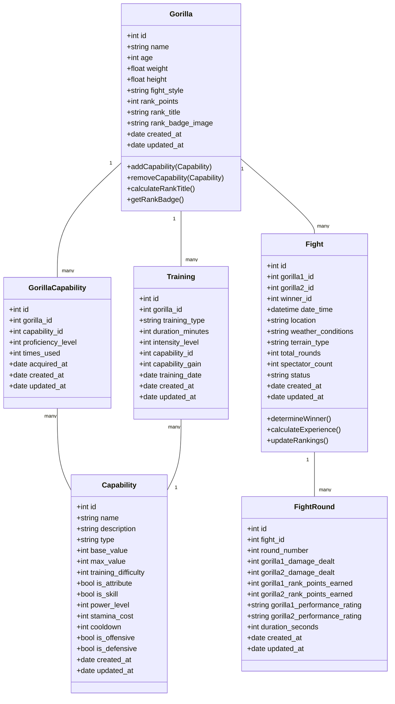

# Updated Guerrilla Fight Simulator Database Structure

Based on your feedback, I've simplified the database structure by combining skills and attributes into a single entity called GorillaCapability, as both are trainable characteristics. I've also maintained the streamlined fight system from the previous update.

Here's the updated Mermaid class diagram with these modifications:

### Key Changes

1. **Combined Skills and Attributes** - Merged skills and attributes into a single "Capability" entity, recognizing that both are trainable characteristics:
   - The new Capability entity can represent both basic attributes (strength, agility, etc.) and specific fighting skills
   - Each capability has flags (is_attribute, is_skill) to distinguish its type
   - Common properties like training difficulty apply to all capabilities
   - Skill-specific properties (power_level, stamina_cost, etc.) are included in the same entity

2. **Simplified Relationship Structure** - GorillaCapability now serves as the single join table connecting gorillas to all their capabilities:
   - Tracks proficiency level for each capability
   - Records usage statistics
   - Maintains acquisition dates

3. **Enhanced Training System** - The Training entity now directly references capabilities:
   - Training sessions can target any capability (attribute or skill)
   - Capability gains are tracked consistently
   - Training difficulty is factored into the capability entity

4. **Round-Based Fight System** - Separated the Fight entity into Fight and FightRound entities:
   - Fight entity contains overall fight information (participants, location, weather, etc.)
   - FightRound entity tracks round-specific details (damage dealt, points earned, performance ratings)
   - This allows for detailed tracking of fight progression through multiple rounds
   - Round performance metrics can be used to determine the overall fight winner

5. **Integrated Fight Style** - Maintained fight style as a simple choice field on the Gorilla entity.

6. **Integrated Rank System** - Incorporated rank functionality directly into the Gorilla entity:
   - Removed the separate Rank entity and integrated essential rank information into Gorilla
   - Added rank_title and rank_badge_image fields to the Gorilla entity
   - Implemented calculateRankTitle() method to determine rank title based on rank_points
   - Added getRankBadge() method to retrieve the appropriate badge image for the current rank
   - This simplifies the data model while maintaining all rank functionality

### Benefits of This Approach

1. **Unified Training System** - A single, consistent approach to training and improving all gorilla capabilities.
2. **Simplified Data Model** - The structure remains clear and maintainable with fewer entities and relationships.
3. **Flexible Capability System** - The combined approach allows for capabilities that blend attributes and skills.
4. **Consistent Progression** - All capabilities follow the same progression and improvement rules.
5. **Streamlined Code Base** - Less duplication in code that handles attributes and skills.
6. **Detailed Fight Analysis** - Round-by-round metrics allow for deeper analysis of fight performance.
7. **More Realistic Simulation** - The round-based system better reflects how real fights progress over time.
8. **Fair Winner Determination** - Using round performance to judge the overall winner creates a more balanced system.
9. **Integrated Rank System** - Rank functionality is directly tied to the gorilla, eliminating the need for complex joins.
10. **Reduced Database Complexity** - Fewer tables and relationships make queries simpler and more efficient.
11. **Simplified Rank Calculations** - Rank calculations happen directly on the Gorilla model where the rank points are stored.

This enhanced structure provides a more focused and intuitive model for your guerrilla fight simulator while adding depth to the fighting mechanics through the round-based system and simplifying the rank system implementation.